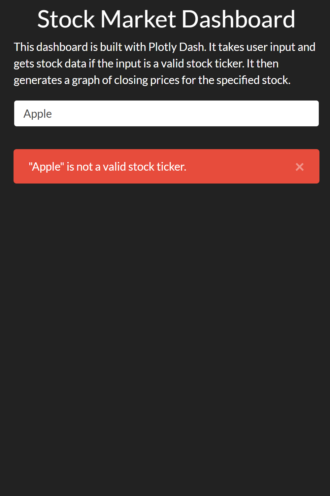
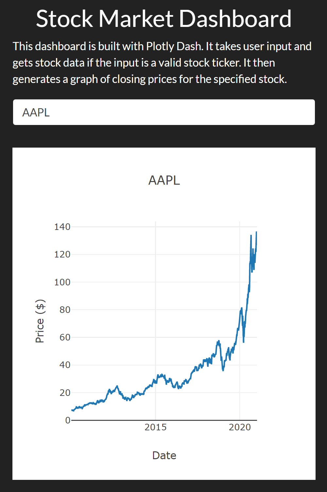

# Stock-Market-Dashboard

## Description
Since I was interested in learning how to create dashboards to present data visualizations, I did this project, which is a dashboard web app that generates a graph of stock prices for a user-specified stock ticker.  The dashboard does not load in a file, but instead uses pandas datareader to fetch the data if the user input is a valid stock ticker.  The web app uses responsive design and should work on both mobile and desktop.

#### Screenshots


<p float = "center">
  
  
</p>

## Setup
First, make sure that you have Python installed on your device.  This project uses Python 3.9.1, but should work for Python 3.x.
To avoid conflicting dependencies, creating a virtual environment, either with [pip](https://uoa-eresearch.github.io/eresearch-cookbook/recipe/2014/11/26/python-virtual-env/) or [Anaconda](https://uoa-eresearch.github.io/eresearch-cookbook/recipe/2014/11/20/conda/), is highly recommended.

Download the files onto your system, either by downloading it directly in the browser or entering the following into the command line:
```sh
$ git clone https://github.com/KevinZZhou/Stock-Prices-Dashboard.git
```

To download the required packages, activate the virtual environment, navigate to the project directory, and enter the following:

pip:
```sh
$ pip install -r requirements.txt
```
Anaconda:
```sh
$ conda install --file requirements.txt
```

After this, run app.py within an IDE or navigate to the project directory and enter the following in the command line:
```sh
$ python app.py
```

## Technologies Used
This dashboard was coded in Python using [Dash](https://plotly.com/dash/), which allows users to build analytical web apps with ease.  CSS and Bootstrap were used as well to format the dashboard.